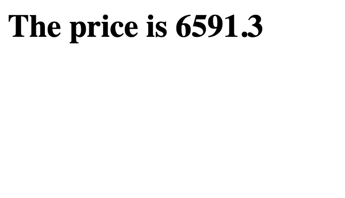

# Bitcoin Ticker 
## It tell the current price of  bitcoin using [Bitcoin Average](https://bitcoinaverage.com/) api
---
## Prerequisites
1. Get the public and private keys from the website above 
2. Create a .env file and assign variable to public and the private keys using the names given in line 10 and line11 of server.js

---
## Installation 
```bash
npm i 
npm start
```
---
### go to http://localhost:3000/ on your browser 
---
## Screenshots



