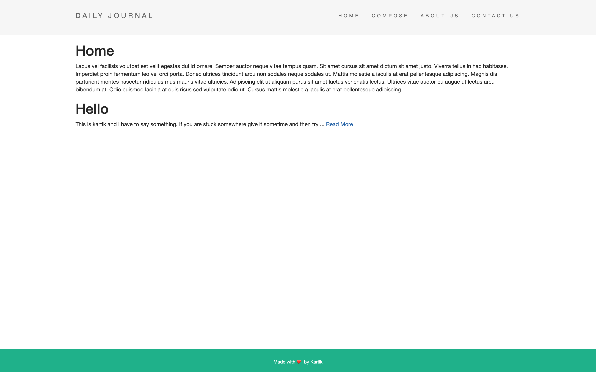

# Blogpost App

## This app stores the blogs in the local mongodb database 

## Prerequisites
1. Install mongodb server from [here](https://www.mongodb.com/download-center/community)

1. [Node js ](https://nodejs.org/en/)


## Installation

```bash
npm i 
npm start
```

go to http://localhost:3000 

---
## Screenshots

### Home


---
---

### Expand a post  


---
---

### Compose a new post 


---
---

### Edit a Post 

